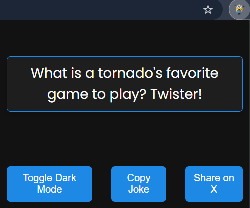

# Jokes Extension

Jokes is a Chrome extension that provides a quick and easy way to get a laugh while browsing the web. With a simple click, you can view a random joke to brighten your day.

## Features

- Display a random joke with a single click
- Toggle between light and dark modes
- Copy jokes to clipboard
- Share jokes on X (formerly Twitter)
- Lightweight and easy to use
- Simple and clean user interface

## Installation

1. **Clone the repository:**
    ```bash
    git clone https://github.com/HackesticMedusa/JokesExtension.git
    ```

2. **Open Chrome and navigate to the Extensions page:**
    ```plaintext
    chrome://extensions/
    ```

3. **Enable Developer mode by clicking the toggle switch in the top right corner.**

4. **Click the "Load unpacked" button and select the directory where you cloned the repository.**

## Usage

1. **Click on the Jokes extension icon in the Chrome toolbar.**
2. **A popup will appear displaying a random joke.**
3. **Use the "Toggle Dark Mode" button to switch between light and dark modes.**
4. **Click the "Copy Joke" button to copy the joke to your clipboard.**
5. **Click the "Share on X" button to share the joke on X.**

## Screenshot



## Contributing

Contributions are welcome! Please fork the repository and create a pull request with your changes.

## License

This project is licensed under the MIT License. See the [LICENSE](LICENSE) file for details.

## Contact

For any inquiries or issues, please contact [HackesticMedusa](mailto:ankurkarmakar247@gmail.com).

---

© 2024 Ankur Karmakar. All rights reserved.